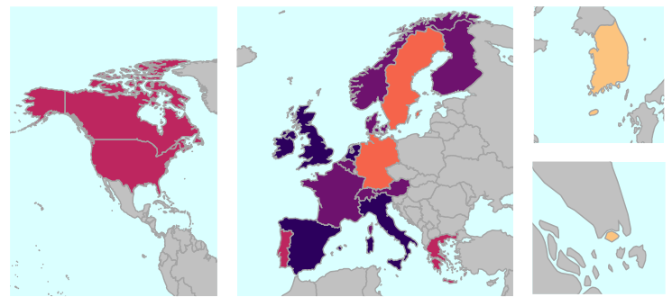

```{r setup, include=FALSE}
rm(list=ls())
#Insert your path
knitr::opts_chunk$set(echo = TRUE)
#path <- "/Users/siviadenicolo/Documents/GitHub/Lockdown_policies_COVID19/" 
path <- "~/GitHub/Lockdown_policies_COVID19/" 
source(paste0(path, "Code/Angela/packages.R"))
```

# Introduction 

Since the beginning of the COVID-19 epidemic, policymakers in different countries have introduced different political action to contrast the contagion. The containment restrictions span from worldwide curfews, stay-at-home orders, shelter-in-place orders, shutdowns/lockdowns to softer measures, and stay-at-home recommendations and including besides the development of contact tracing strategies and specific testing policies. The pandemic has resulted in the largest amount of shutdowns/lockdowns worldwide at the same time in history.

The timing of the different interventions, concerning the spread of the contagion both at a global and intra-national level, has been very different from country to country. This situation, in combination with demographical, economic, health-care-related, and area-specific factors, has resulted in different contagion patterns across the world.

Therefore, our goal is two-fold. The aim is to measure the effect of the different political actions by analysing and comparing types of actions from a global perspective and, at the same time, to benchmark the effect of the same action in a heterogeneous framework such as the Italian regional context.

In doing so, some issue arises concerning the identification and codification of the different measures undertaken by governments, the analysis related to whether a strategies resemblance can be detected across countries and the measurement of the effects of containment policies on contagion. Thus, after an introductory section explaining data and variables, a second section regards some explanatory analysis facing the codification of containment policies and the strategies resembling patterns. The third section deals with the measurement of policies effect from a global perspective, lastly the forth section analyze Italian lockdown and regional outcomes. The conclusions are drawn in the last section.

# Data and Variables

The data repositories used for this project are *COVID-19 Data Repository by the Center for Systems Science and Engineering (CSSE) at Johns Hopkins University* [^1] for contagion data (@Jhon), and *Oxford COVID-19 Government Response Tracker (OxCGRT)*[^2] for policies tracking (@Oxford), together with *World Bank Open Data Repository* for demographic data.

As regards contagion data, we used as main variable the active cases, defined as the total confirmed cases (cumulative confirmed positive cases including presumptive positive) minus total deaths minus total recovered. For further information, see @Oxford. 

As regards policy variables, the *Oxford COVID-19 Government Response Tracker (OxCGRT)* collects all the containment policies adopted by the government worldwide by making available information on 11 indicators of government containment responses of ordinal type. These indicators measure policies on a simple scale of severity/intensity and are reported for each day a policy is in place, specifying if they are "targeted", applying only to a sub-region of a jurisdiction, or a specific sector; or "general", applying throughout that jurisdiction or across the economy.

The ordinal containment variables considered are:

```{r, echo = FALSE, comment = F, warning= F, silent = T}

tab_EC <- data.frame(Name = c("School closing  ", "Workplace closing  ", "Cancel public events  ", "Restrictions on gatherings  ", "Close public transport  ", "Stay at home requirements          ", "Restrictions on internal movements  ", "International travel controls  ", "Public info campaigns  ","Testing policy  ", "Contact Tracing Policy  "),  Category = c("0- No measures 1 - recommend closing 2 - Require closing (only some levels or categories, eg just high school, or just public schools) 3 - Require closing all levels", "0- No measures 1 - recommend closing (or work from home) 2 - require closing (or work from home) for some sectors or categories of workers 3 - require closing (or work from home) all-but-essential workplaces (e.g. grocery stores, doctors)", "0- No measures 1 - Recommend cancelling 2 - Require cancelling", " 0 - No restrictions 1 - Restrictions on very large gatherings (the limit is above 1000 people) 2 - Restrictions on gatherings between 101-1000 people 3 - Restrictions on gatherings between 11-100 people 4 - Restrictions on gatherings of 10 people or less", "0 - No measures 1 - Recommend closing (or significantly reduce volume/route/means of transport available) 2 - Require closing (or prohibit most citizens from using it)", "0 - No measures 1 - recommend not leaving house 2 - require not leaving house with exceptions for daily exercise, grocery shopping, and 'essential' trips 3 - Require not leaving house with minimal exceptions (e.g. allowed to leave only once a week, or only one person can leave at a time, etc.)", "0 - No measures 1 - Recommend not to travel between regions/cities 2 - internal movement restrictions in place",  "0 - No measures 1 - Screening 2 - Quarantine arrivals from high-risk regions 3 - Ban on arrivals from some regions 4 - Ban on all regions or total border closure", "0 -No COVID-19 public information campaign 1 - public officials urging caution about COVID-19 2 - coordinated public information campaign (e.g. across traditional and social media)", "0 - No testing policy 1 - Only those who both (a) have symptoms AND (b) meet specific criteria (e.g. key workers, admitted to hospital, came into contact with a known case, returned from overseas) 2 - testing of anyone showing COVID-19 symptoms 3 - open public testing (e.g. drive through testing available to asymptomatic people)", "0 - No contact tracing 1 - Limited contact tracing - not done for all cases 2 - Comprehensive contact tracing - done for all identified cases"))
knitr::kable(tab_EC)
```


[^1]: https://github.com/CSSEGISandData/COVID-19/tree/master/csse_covid_19_data
[^2]: https://github.com/OxCGRT/covid-policy-tracker


Lastly, a set of confounders variables has been considered in the analysis. These can be divided into three main areas:

  1. **Longitudinal economic** variables from @Oxford;

  2. **Longitudinal health system** variables from @Oxford;
  
  3. **Fixed demographic/economic/health variables** from the [World Bank Open Data](https://data.worldbank.org/).
  
  
## Longitudinal economic Variables

We analyze $4$ economic variables from @Oxford:

```{r, echo = FALSE, comment = F, warning= F, silent = T}
path <- "~/GitHub/Lockdown_policies_COVID19/" 
#path <- "/Users/siviadenicolo/Documents/GitHub/Lockdown_policies_COVID19/" 

source(paste0(path, "Code/Angela/packages.R"))
load(paste0(path, "Code/Silvia/cluster20paesi.Rdata"))
load(paste0(path, "Code/Silvia/SAVEPLOTS.Rdata"))
load(paste0(path, "Code/Angela/Data/out.RData"))
#path <- "/Users/siviadenicolo/Documents/GitHub/Lockdown_policies_COVID19/" 
load(paste0(path, "Code/Angela/Data/var.RData"))

tab_EC <- data.frame(Name = c("Income Support", "Debt/contract relief for households", "Fiscal measures", "International support"), Type = c("Ordinal  ", "Ordinal  ", "USD  ", "USD  "),  Category = c("0 - no income support; 1 - government is replacing less than 50% of lost salary, 2 - government is replacing more than 50% of lost salary", "0 - No; 1 - Narrow relief, specific to one kind of contract; 2 - broad debt/contract relief", "", ""))
knitr::kable(tab_EC)
```

However, having $9$ ordinal policies lockdown covariates, the two first economic variables are combined into one continuous variable using the Polychoric Principal Component Analysis, to diminish the number of covariates inside the model.

```{r, echo = FALSE, comment = F, warning= F, silent = T}
quiet(pca_EC <- polychoric(dat[,var_EC[1:2]]),all = T)
matPCA_ec <- cbind(rep(0,2),pca_EC$tau)
dat$E1_Income_support_f <- as.factor(dat$E1_Income_support)
dat$E1_Income_support_f <- recode_factor(dat$E1_Income_support_f,
                                                  "0" = paste0(matPCA_ec[1,1]),
                                                  "1" = paste0(matPCA_ec[1,2]),
                                                  "2" = paste0(matPCA_ec[1,3]))

dat$E1_Income_support_f <- as.numeric(dat$E1_Income_support_f)
dat$E2_Debt_contract_relief_f <- as.factor(dat$E2_Debt_contract_relief)
dat$E2_Debt_contract_relief_f <- recode_factor(dat$E2_Debt_contract_relief_f,
                                                        "0" = paste0(matPCA_ec[2,1]),
                                                        "1" = paste0(matPCA_ec[2,2]),
                                                        "2" = paste0(matPCA_ec[2,3]))
dat$E2_Debt_contract_relief_f <- as.numeric(dat$E2_Debt_contract_relief_f)
```

```{r, echo = FALSE, comment = F, warning= F, silent = T}
p2 <- dat %>% ggplot(aes(x=as.integer(date2), y=pca_EC, group=Clusters, color=Clusters)) + geom_smooth(method = 'loess',formula='y ~ x')  + ylab("Economics PCA") + xlab("Days after first case")+ xlim(0,max(as.integer(dat$date2))) + theme_classic() 

p2
```

The Economic PCA has a temporal pattern, with more considerable variability near the last days of observations. Korea and Singapore's population received less money from the government than the other countries. The European ones are the best as financial support to society.

Therefore, the USD's two economic variables are examined and transformed into a logarithmic scale to de-emphasize large values.

```{r, echo = FALSE, comment = F, warning= F, silent = T}
p2 <- dat %>% ggplot(aes(x=as.integer(date2), y=E3_Fiscal_measures, group=Clusters, color=Clusters)) + geom_smooth(method = 'loess',formula='y ~ x')  + ylab("Fiscal Measures in log scale") + xlab("Days after first case")+ xlim(0,max(as.integer(dat$date2))) + theme_classic() 

p2
```

```{r, echo = FALSE, comment = F, warning= F, silent = T}
p2 <- dat %>% ggplot(aes(x=as.integer(date2), y=E4_International_support, group=Clusters, color=Clusters)) + geom_smooth(method = 'loess',formula='y ~ x')  + ylab("International support") + xlab("Days after first case")+ xlim(0,max(as.integer(dat$date2))) + theme_classic() 

p2
```

The fiscal measure and international support variables have a large within-clusters variability. As we will see, these two variables will not enter into the final model.

For further details about the definition of the economic variables, please see the [BSG Working Paper Series](https://www.bsg.ox.ac.uk/sites/default/files/2020-05/BSG-WP-2020-032-v5.0_0.pdf).

## Demographic/economic/health system fixed variables

We analyze $8$ variables from the [World Bank Open Data](https://data.worldbank.org/) that are fixed along the temporal dimension:

```{r, echo = FALSE, comment = F, warning= F, silent = T}
tab_FIX <- data.frame(Name = c("Population", "Population ages 65 and above (% of total population)", "Population density (people per sq. km of land area)", "Hospital beds (per 1,000 people)", "Death rate, crude (per 1,000 people)", "GDP growth (annual %)", "Urban population (% of total population)", "Surface area (sq. km)"), Measurement = c("Numeric", "Numeric", "Numeric", "Numeric","Numeric", "Numeric", "Numeric", "Numeric"))
knitr::kable(tab_FIX)
```

```{r, echo = FALSE, comment = F, warning= F, silent = T}
p1 <- ggplot(dat, aes(x=Clusters, y=log(pop), fill=Clusters)) + geom_boxplot() + ylab("Population in log scale") +
  theme(legend.position = "none")
p2 <- ggplot(dat, aes(x=Clusters, y=pop_65, fill=Clusters)) + geom_boxplot() + theme(legend.position = "none") + ylab("Population ages 65 and above per 1000")

p1
p2
```

Korea and Singapore seem to be the two youngest countries; it could be a reason for their low number of active people during the pandemic period.

```{r, echo = FALSE, comment = F, warning= F, silent = T}

p1 <- ggplot(dat, aes(x=Clusters, y=pop_density, fill=Clusters)) + geom_boxplot() + theme(legend.position = "none") + ylab("Population density per sq.km")

p2 <- ggplot(dat, aes(x=Clusters, y=hosp_beds, fill=Clusters)) + geom_boxplot() + ylab("Hospital beds per 1000") +
  theme(legend.position = "none")


p1
p2
```

The population density of the first Cluster seems weird, it is due by the Singapore situation. Probably, the number of hospital beds are directly associated.

```{r, echo = FALSE, comment = F, warning= F, silent = T}

p1 <- ggplot(dat, aes(x=Clusters, y=pop_death_rate, fill=Clusters)) + geom_boxplot() + theme(legend.position = "none") + ylab("Death rate per 1000")

p2 <- ggplot(dat, aes(x=Clusters, y=log(gdp), fill=Clusters)) + geom_boxplot() + ylab("gdp in log scale") +
  theme(legend.position = "none")

p1
p2
```


```{r, echo = FALSE, comment = F, warning= F, silent = T}

p1 <- ggplot(dat, aes(x=Clusters, y=pop_urban_log, fill=Clusters)) + geom_boxplot() + theme(legend.position = "none") + ylab("Urban population in log scale")

p2 <- ggplot(dat, aes(x=Clusters, y=surface_area_log, fill=Clusters)) + geom_boxplot() + ylab("Surface area in log scale") +
  theme(legend.position = "none")

p1
p2
```

Another time the Singapore situation is clear analyzing the first Cluster. We have a large density population, so lower surface area than the ones of the other countries.

## Longitudinal health system variables

We analyze $2$ health systems' variables from @Oxford:

```{r, echo = FALSE, comment = F, warning= F, silent = T}
tab_H <- data.frame(Name = c("Emergency Investment in healthcare", "Investment in vaccines"), Measurement = c("USD", "USD"), Description = c("Short-term spending on, e.g, hospitals, masks, etc ", "Announced public spending on vaccine development") )
knitr::kable(tab_H)
```

The set of the health systems' variables are transformed into one continuous variable using the Polychoric Principal Component Analysis, in order to reduce the number of covariates in the model.

```{r, echo = FALSE, comment = F, warning= F, silent = T}
p2 <- dat %>% ggplot(aes(x=as.integer(date2), y=pca_hs, group=Clusters, color=Clusters)) + geom_smooth(method = 'loess',formula='y ~ x')  + ylab("Health support PCA") + xlab("Days after first case")+ xlim(0,max(as.integer(dat$date2))) + theme_classic() 

p2
```

# Containment strategies and resembling patterns 

Identification and codification of different measures undertaken by governments performed by the University of Oxford result in $11$ ordinal variables selected as lockdown policies. This situation sets up the necessity to analyze and aggregate them in a synthetic way to find out whether specific combinations of those policies making up political strategies come out to have a resemblance pattern across countries.

Therefore, we performed a Principal Component Analysis based on the polychoric correlation. It allows the estimation of the correlation between two theorized normally distributed continuous latent variables, from two observed ordinal variables. It has no closed-form, but it is estimated via MLE assuming the two latent variables follow a bivariate normal density.

The interpretation of the first three principal components (accounting for the 80\% of total variance) appears to be clear in the following figure: the first one is closely related with freedom of movements and gathering restrictions together with information campaigns strategy, crucial in cases of draconian measures, the second one is related with the strategy of informing and testing the population, lastly the third one is related to informing and contact tracing the population. Summarizing, on one hand a first containment strategy aims at social distancing the entire population, on the other hand a second one aims at act locally and rapidly detect and isolate the positive cases, with two (alternative or complementary) tools: tracing contacts of infected and/or blanket population testing.

```{r figs,  echo=FALSE, fig.cap="\\label{fig:figs}First 3 Principal Components Loadings."}
load(paste0(path, "Code/Silvia/cluster20paesi.Rdata"))
load(paste0(path, "Code/Silvia/SAVEPLOTS.Rdata"))

peach=rainbow(3, start=0.08, end=0.17)
gray=viridis(begin=0, end=0.5, 8,option = "D")
ggplot(dpca, aes(x=PC, y=Loadings, fill=policies, group=position))+
 geom_bar(stat="identity", position="dodge")+
  coord_flip()+scale_fill_manual("", breaks=c(apol, rpol), 
                                 values=c(peach[1:3], gray[1:8]))

```

We want now to figure out which countries have adopted the undefined strategies and whether there is a strategy resemblance across countries, considering both the combination of measures undertaken and the timing w.r.t. the day of the first contagion detection on country soil.
In order to do so, we performed a functional co-clustering of the first three principal components taking into account 20 countries in a specific time span (which varies from country to country) that depends on when the first COVID cases have been detected on national soil. We performed an alignment of the contagion pattern from the 10th day before first contagion detection to include relevant information on the prevention measures.

Considering a matrix of 20 countries (rows) of 3 curves (columns or functional features- restriction-based, testing-based, and tracing-based policies) s.t. $x=(x_{ij}(t))_{1\leq i \leq 20; 1 \leq j\leq3}$ with $t \in [0,85]$, we reconstructed the functional form of the data from their discrete observations (85 days) by assuming that curves belong to a finite-dimensional space spanned by a basis of functions, and then we estimated a functional latent block model used for co-clustering with the funFEM R package developed by @funfem. 

The two policy clusters depict Restriction-based policies on one hand, Tracing, and Testing-based policies, on the other hand, confirming that these last two policies reflect a common strategy as described above.

The countries clusters are displayed in the following figures: (South Korea, Singapore), (Germany, Sweden), (USA, Canada, Greece, Portugal), (Italy, Spain, Ireland, UK, Netherlands), (Norway, Denmark, Finland, France, Belgium, Switzerland, Austria). The interpretation can be grasped in the following figure. South Korea and Singapore's political strategy is characterized by the detection and isolation of the positive cases via contact tracing and mild testing policies, without any relevant social distancing action. On the contrary, Germany, Sweden's strategy was to detect and isolate positive cases via an extensive testing policy strategy, without any strong social distancing measures in order to protect the economy. A very different strategy has been adopted by the cluster, including Italy, Spain, Ireland, UK, and Netherlands, which acted with social distancing measures at different temporal stages (considering, in particular, the north European countries of the cluster) but promptly concerning the first contagion inside national borders. In particular, the strategies of Ireland, UK, and the Netherland were stringent concerning school and workplace closing as well as gathering and international movement restriction, weaker as regards stay at home recommendations, internal movement restriction, and transport closing but at the same time relying on a strong information campaign. On the other hand, Italy and Spain sharpened up stay at home and internal movement restrictions. USA, Canada, Greece, and Portugal have adopted intermittently social distancing measures in addition with strong social tracing during the second part of the considered period. Lastly, Norway, Denmark, Finland, France, Belgium, Switzerland, Austria has adopted intermediate social distancing measure, in line with other European countries, but without any relevant testing or tracing measure in addition. 




```{r figs3, fig.align='center', echo=FALSE, fig.width = 8, fig.cap="\\label{fig:figs3}Clusters average functionals related to Social Distancing Restrinction, Testing and Tracing policies aligned at the day of the first contagion (vertical blue line)."}
ggarrange(restrict, testt, trace, ncol=3, nrow=1, common.legend = TRUE, legend="bottom")

```


# Effect of policies from a global perspective 

We want to analyze which countries have adopted the "optimal" policy measures to contain the contagion of COVID-19. We restrict the full range of responses to COVID-19 from governments around the countries analyzed in Section 3, i.e., Korea, Singapore, Germany, Canada, Sweden, Greece, Portugal, Spain, United States of America, Irland, United Kingdom, Italy, Netherlands, Austria, Switzerland, Finland, Norway, Denmark, and France.

The daily number of active persons is analyzed as a measure of the COVID-19 situation, i.e., the number of confirmed minus the number of deaths minus the number of recovered. Being a count variable, we decide to use a Negative Binomial Regression, also correcting for the possible overdispersion. Therefore, the hierarchical structure is induced by the structure of countries nested inside the clusters and by the longitudinal structure. For that, we decide to use a generalized mixed model with family negative binomial. The countries, clusters, and date's information are supposed to be used as random effects in the model. The indicators from @Oxford and the demographic/economic/health variables from the [World Bank Open Data](https://data.worldbank.org/) enter as fixed effects in the model.

So, the aim is to understand how the lockdown policies influence the number of active people. The observations are aligned concerning the first active case across the countries to have observations directly comparable from a longitudinal point of view. The following Figure represents the number of active people during $131$ days for each country, and the corresponding mean value of the clusters.

```{r, echo = FALSE, comment = F, warning= F, silent = T , fig.cap="\\label{fig:figsA1} Number of active people over population across time for each countries. The mean of each cluster is also displayed."}
path <- "~/GitHub/Lockdown_policies_COVID19/" 
#path <- "/Users/siviadenicolo/Documents/GitHub/Lockdown_policies_COVID19/" 

source(paste0(path, "Code/Angela/packages.R"))
load(paste0(path, "Code/Silvia/cluster20paesi.Rdata"))
load(paste0(path, "Code/Silvia/SAVEPLOTS.Rdata"))
load(paste0(path, "Code/Angela/Data/out.RData"))
#path <- "/Users/siviadenicolo/Documents/GitHub/Lockdown_policies_COVID19/" 
load(paste0(path, "Code/Angela/Data/var.RData"))
gd <- dat %>% 
  group_by(Clusters, date2) %>% 
  mutate(active_group = round(mean((active/pop)*1000),3) )

gd <- gd %>% 
  mutate(active_over_pop_1000 = round((active/pop)*1000,3))

a <- ggplot(gd, aes(x = as.integer(date2), y = active_over_pop_1000)) +
  geom_line(aes(group = id), alpha = .7) +
  geom_smooth(aes(x = as.integer(date2), y =  active_group, color = Clusters),method = 'loess',formula = 'y ~ x',se = T,size = 1.5) +
  theme_classic()  + ylab("Active/pop per 1000") + xlab("Days after first case") + xlim(0,max(as.integer(gd$date2)))
#  +scale_x_date(date_labels = "%b %d")
a
```

The temporal variability between countries and clusters is clear, as confirmation about the decision to use the generalized mixed model.


## Model 

The aim is to model the number of active people, i.e., confirmed - deaths - recovered, after $14$ days, when the lockdown policies were applied. Therefore, the number of **active people lagged** to $t+14$ days, and an **offset term** representing the number of active people at time $t$ are considered to analyze the influences of the restrictions imposed at time $t$ on the number of active at time $t+14$.

The data has a **three-level structure**. The variability of the data comes from nested sources: countries are nested within clusters, and the observations are repeated across time, i.e., longitudinal data.

For that, the mixed model approach is considered to exploit the different types of variability coming from the hierarchical data structure. At first, the Intraclass Correlation Coefficient (ICC) is computed:

$$
ICC_{date; active} = 0.0936 \quad ICC_{Countries; Active} = 0.4015 \quad ICC_{Clusters; Active} = 0.0951 
$$

```{r, echo = FALSE, warning= F, comment= F}
#ICCest(date2, active, dat) 
#ICCest(id, active, dat) 
#ICCest(Clusters, active, dat)
```

Therefore, the $40.15\%$ of the data's variance is given by the random effect of the countries, while the $9.36\%$ by the temporal effect and $9.51\%$ by the clusters effect. Therefore, the mixed model requires a random effect for the countries; the other two effects are selected using the conditional AIC.

The dependent variable is the number of active persons; therefore, a count data model is considered. To control the overdispersion of our data, the negative binomial regression with Gaussian-distributed random effects is performed using the glmmTMB R package developed by @glmmTMB. Let $n$ countries, and country $i$ is measured at $n_i$ time points. The active person $y_{ij}$ count at time $t+14$, where $i=1,\dots, n$ and $j = 1, \dots,n_i$, follows the negative binomial distribution:

$$y_{ij} \sim NB(y_{ij}|\mu_{ij}, \theta) = \dfrac{\Gamma(y_{ij}+ \theta)}{\Gamma(\theta) y_{ij}!} \cdot \Big(\dfrac{\theta}{\mu_{ij} + \theta}\Big)^{\theta}\cdot \Big(\dfrac{\mu_{ij}}{\mu_{ij} + \theta}\Big)^{y_{ij}}$$
where $\theta$ is the dispersion parameter that controls the amount of overdispersion, and $\mu_{ij}$ are the means. The means $\mu_{ij}$ are related to the other variables via the logarithm link function:

$$\log(\mu_{ij}) = \log(T_{ij}) + X_{ij} \beta + Z_{ij} b_i \quad b_i \sim \mathcal{N}(0,\psi)$$
      
where $\log(T_{ij})$ is the offset that corrects for the variation of the count of the active person at time $t$, and $\text{E}(y_{ij}) = \mu_{ij}$, $\text{Var}(y_{ij}) = \mu_{ij} (1 + \mu_{ij}\theta)$ from @Hardin. The $X_{ij}$ is the design matrix for the fixed effects, i.e., economic, demographic and health variables (the confounders described in section 2), and $\beta$ the corresponding set of fixed parameters. In the same way, $Z_{ij}$ is the design matrix describing the random effect regarding the countries and the date, and $b_i$ the corresponding parameter.

After some covariates selection steps and random effects selection, the final model returns these estimations for the fixed effects:

```{r, echo = FALSE, comment = F, warning= F, silent = T}
outMod <- summary(mod1)
outCoef <- outMod$coefficients$cond
rownames(outCoef) <- c("Intercept", "Economic PCA", "Population density in log scale",
                       "Health System PCA", "Recommend closing workplace", "Require closing workplace", "Require closing workplace all-but-essential workplaces", "Restrictions on gatherings <1000 people", " Restrictions on gatherings between 101-1000 people", "Restrictions on gatherings between 11-100 people", "Restrictions on gatherings of < 10 people", "Recommend transport closing", "Require transport closing", "Recommend not leaving house", "Require not leaving house (only essential trips)", "Require not leaving house with minimal exceptions", "Testing only who both have symptoms and specific criteria", "Testing everyone with symptoms", "Open public testing", "Limited tracing", "Comprehensive tracing", "DEU SWE", "CAN USA GRC PRT", "ESP GBR IRL ITA NLD", "AUT BEL CHE DNK FIN FRA NOR"
                       )
knitr::kable(outCoef, digits = 3)
```

The estimations of the categorical policy coefficients have as reference the no measure category. In the same way, the first cluster, i.e., Korea and Singapore, is used as the reference for the cluster coefficients.

The variance for the random effects are equals:

```{r, echo = FALSE, comment = F, warning= F, silent = T}
outCoefRE <- as.data.frame(rbind(outMod$varcor$cond$id[1],outMod$varcor$cond$date2[1]))
rownames(outCoefRE) <- c("Country", "Date")
colnames(outCoefRE) <- c("Variance")
knitr::kable(outCoefRE, digits = 3)
```

We drop off the random effect associated with the Clusters having low variability, and the conditional AIC equals the one computed without the variable Clusters as a random intercept.

```{r, echo = FALSE, comment = F, warning= F, silent = T, eval = F}
#r.squaredGLMM(mod1)
#lognormal 0.2873722 0.8999491
#trigamma  0.2457431 0.7695816
```

The marginal $R^2$, i.e., the variance explained by the fixed effects, equals $0.28$, while the conditional one, i.e., the variance explained by the entire model, including both fixed and random effects, equals $0.89$ considering the lognormal approximation @Nakagawa. 

Therefore, the model seems correctly formulated. 

## Results

We will analyze the effects related to the following variables:

1. The fixed effect of the lockdown policies;

2. The fixed effect of the clusters;

3. The fixed effect of the combination of lockdown policies and clusters;

3. The random effect of the countries;

### LOCKDOWN POLICIES

In the following plot, we can see the effect of lockdown policies on predicted actives after 14 days.

```{r,echo=FALSE, warning = FALSE, comment = FALSE, silent = T, fig.align="center",fig.width=10,fig.height=5}
out0 <- as.data.frame(ggeffect(mod1, terms = "workplace_closingF"))
out0$Value <- c("No measures", "Recommend closing or work from home", "Require closing for some sector" ,"Require closing all-but-essential workplaces")
out1 <-as.data.frame(ggeffect(mod1, terms = "gatherings_restrictionsF"))
out1$Value <- c("No measures", "> 1000", "100-1000 people", "10-100 people", "< 10 people")
out2 <- as.data.frame(ggeffect(mod1, terms = "transport_closingF"))[c(1,3),]
out2$Value <- c("No measures", "Require closing")
out3 <- as.data.frame(ggeffect(mod1, terms = "stay_home_restrictionsF"))[c(1,4),]
out3$Value <- c("No measures", "Minimal exceptions")
out4 <- as.data.frame(ggeffect(mod1, terms = "testing_policyF"))
out4$Value <- c("No measures", "Specific criteria", "Symptoms", "Open")
out5 <- as.data.frame(ggeffect(mod1, terms = "contact_tracingF"))
out5$Value <- c("No measures", "Limited", "Comprehensive")

OUT <- rbind(out0, out1, out2, out3, out4, out5)
OUT$Policies <- c(rep("Workplace Closing", nrow(out0)),
                  rep("No Gathering", nrow(out1)),
                  rep("No Transport", nrow(out2)),  
                  rep("Stay Home", nrow(out3)),
                  rep("Testing", nrow(out4)),
                  rep("Tracing", nrow(out5)))

colnames(OUT)[1] <- "Strength"
OUT$Policies <- as.factor(OUT$Policies)
OUT$Strength <- as.factor(OUT$Strength)

#OUT$cols <- c("slateblue1", "slateblue2", "slateblue3", "slateblue4")

quiet(ggplot(OUT, aes(Policies, predicted, fill = Strength)) +
  geom_bar(stat = "summary", fun = "mean", 
           position = position_dodge(width = 0.9)) +
  scale_y_continuous(name = "Effect of policies on predicted actives after 14 days", limits = c(0, 2500))+ geom_errorbar(stat = "summary", fun.data = "mean_sdl", 
                fun.args = list(mult = 2),na.rm = FALSE,
                position =  position_dodge(width =2)) +
  geom_text(aes(label=OUT$Value, group = OUT$Strength),   hjust = -0.2, size = 3,
            position = position_dodge(width = 1),
            inherit.aes = TRUE)  + coord_flip() + scale_fill_viridis(discrete=T) +
  theme_minimal() + ylab(""), all = TRUE) 
```

We can note that in general, the strong lockdown policies work with respect to impose no measure. For example, if the government prohibits most citizens from using public transport, the number of active people diminishes around  $39.4\%$ with respect to imposing no public transport measures after $14$ days when the policy lockdown was imposed. Also, we can note that weak gatherings restrictions still work concerning impose no action. For example, restrictions on gatherings between 100-1000 people diminish the number of active persons around $71.62\%$after $14$ days when the policy lockdown was imposed. However, we can see a reverse situation analyzing the effects regarding the variables describing the testing and tracing policies. Probably, strong testing and tracing policies lead to discovering more infected people.

The following plot represents the effects of two policies, i.e., workplace closing and gatherings restriction, on predicted active people $14$ days after applying these policies.

```{r, echo=FALSE, warning = FALSE, comment = FALSE, silent = T, fig.align="center"}
eff1 <- ggeffect(mod1, terms = c("workplace_closingF [0, 3]", "gatherings_restrictionsF"))
attr(eff1, "legend.title") <- "Gatherings Restrictions"
attr(eff1,"title") <- "Workplace closing"

levels(eff1$group) <-  c("No measures", "> 1000", "100-1000 people", "10-100 people", "< 10 people")

quiet(p1 <- plot(eff1)+ ylab("Effect of policies on predicted actives after 14 days")+
  scale_color_viridis(discrete=TRUE,  option="A", direction=-1, end=0.9) +
  theme_minimal(base_size = 12)  + theme(plot.title =element_text(),
                                         axis.title.x = element_blank()), all = TRUE)

eff2 <- ggeffect(mod1, terms = c("testing_policyF", "contact_tracingF", "gatherings_restrictionsF"))
attr(eff2, "legend.title") <- "Contact Tracing"
attr(eff2,"title") <- "Testing Policy"

levels(eff2$group) <-  c("No measures", "Limited", "Comprehensive")

quiet(p2 <- plot(eff2)+ ylab("Effect of policies on predicted actives after 14 days")+
  scale_color_viridis(discrete=TRUE,  option="A", direction=-1, end=0.9) +
  theme_minimal(base_size = 12)  + theme(plot.title =element_text(),
                                         axis.title.x = element_blank()), all = TRUE)

p1
```

The combination of gatherings restrictions and workplace closing works, the number of actives decreases, also if the weak limit on reunion is applied.

### CLUSTERS

The following plot represents the effects of the clusters on predicted actives after $14$ respect to the cluster associated with Italy.

```{r echo=FALSE, warning = FALSE, comment = FALSE, silent = T, fig.align="center"}
#path <- "/Users/siviadenicolo/Documents/GitHub/Lockdown_policies_COVID19/" 
load(paste0(path, "Code/Angela/Data/plot_mapAngela.RData"))

grid.arrange(na2, europe2,                 
             arrangeGrob(kor2, sin2, nrow = 2, ncol=1),
             ncol = 3, nrow=1, widths=c(3,4,2))    
```

The following table represents the tests and p-values respect the countries pairwise comparision adjsted by Tukey's pvalues multiple comparison procedure  adjustment.

```{r echo=FALSE, warning = FALSE, comment = FALSE, silent = T, fig.align="center"}
comp <- summary(comp_cluster)
knitr::kable(data.frame(Std = round(comp$test$sigma,3), Test = round(comp$test$tstat,3), Pvalues = comp$test$pvalues))
```

We can see that Korea and Singapore are the best countries that acted appropriately, while Sweden, Germany, Portugal, and Greece are better than the other European countries. Finally, the USA and Canada are better than the other European countries except for Sweden and Germany. 

### INTERACTION LOCKDOWN POLICIES AND CLUSTERS

In this Section, the effects of the interaction between each significant lockdown policy and clusters are examined.

1. Testing policies

```{r, echo=FALSE, warning = FALSE, comment = FALSE, silent = T, out.width = '40%'}
path <- "~/GitHub/Lockdown_policies_COVID19/" #Insert your path
#path <- "/Users/siviadenicolo/Documents/GitHub/Lockdown_policies_COVID19/" 
load(paste0(path, "Code/Angela/Data/plot_mod.RData"))

pTest
```

2. Contact Tracing

```{r, echo=FALSE, warning = FALSE, comment = FALSE, silent = T, out.width = '40%'}
pCont
```

3. Gatherings Restrictions

```{r, echo=FALSE, warning = FALSE, comment = FALSE, silent = T, out.width = '40%'}
pGath
```

4. Stay Home Restrictions

```{r, echo=FALSE, warning = FALSE, comment = FALSE, silent = T, out.width = '40%'}
pSH
```

5. Workplace Closing

```{r, echo=FALSE, warning = FALSE, comment = FALSE, silent = T, out.width = '40%'}
pW
```

6. Transport Closing

```{r, echo=FALSE, warning = FALSE, comment = FALSE, silent = T, out.width = '40%'}
pTr
```

### COUNTRIES

In this Section, the countries' effects on the number of active people are analyzed, considering $4$ type of scenarios:

1. **No measures** of lockdown, tracing and testing policies;

2. **Maximum restriction** of lockdown, tracing and testing policies;

3. Only maximum level of **contact tracing and testing policies**;

4. Only maximum restriction of **lockdown/social distancing policies**.

The effects are computed considering $100$ and $1000$ active people at time $t$, when the policies are applied. The other covariates are fixed and equal to the mean value.

```{r, echo=FALSE, warning = FALSE, comment = FALSE, silent = T, fig.align="center",fig.width=10}
path <- "~/GitHub/Lockdown_policies_COVID19/"
load(paste0(path, "Code/Angela/Data/plot_ranef.RData"))
pNL
```

If the government doesn't impose any measure to contrast the coronavirus, the number of active people after $14$ days will increase, in particular in the fourth cluster, i.e., Spain, Italy, Irland, United Kingdom, and the Netherlands. The situation gets worst if the number of active people at time $t$ is large.

```{r, echo=FALSE, warning = FALSE, comment = FALSE, silent = T, fig.align="center",fig.width=10}
pALL
```

The situation gets better if the government applied the strong level of restrictions about social distancing and the strong levels of testing and tracing policies. However, the increasing of the number of active people due to testing and tracing policies influences the analysis of the effects, as you can see in the following plot:

```{r, echo=FALSE, warning = FALSE, comment = FALSE, silent = T, fig.align="center",fig.width=10}
pTT
```

The best situation, as expected is the follows:

```{r, echo=FALSE, warning = FALSE, comment = FALSE, silent = T, fig.align="center",fig.width=10}
pOL
```

i.e., the governements apply the strong levels of all lockdown policies, in this case the testing and tracing variables are imposed to $0$.

## To sum up

 1. Lockdown policies work with respect to impose no measure in general;
 
 2. Weak gatherings restrictions still work, i.e., restrictions on gatherings between 100-1000 people;
 
 3. Strong Testing and Tracing policies lead to discovering more infected people;
 
 4. Korea and Singapore are the best countries that acted properly;
 
 5. Sweden, Germany, Portugal, and Greece better than the other UE countries;
 
 6. The USA, and Canada better than the other UE countries except for Sweden and Germany.

# Italian lockdown and regional outcomes

In the previous sections, the effect of lockdown policies on the spread of contagion was estimated for each country, but data is available for some countries at regional level too. The aim in this section is to check for differences among **Italian regions**. Such an analysis is important for our Phase Two, as governors will have more power in tayloring lockdown measures down to their regions' needs.

Data is still available from the same sources as before. The effect of different **policies** has already been estimated, while now **only their aggregate effect** can be assessed. Indeed the countermeasures for COVID19 escalated almost simultaneously all over the country (excepted the Red Zone, but only for few days) and on all sides (as to offices, schools, transit, etc). So in this analysis, all different policies are replaced by a single factor, which is the Phase: Zero, One. As to the newer Phase Two, too few days of data are available, so it will be discarded.

Italian regions are known to be separated by a relevant divide under all socio-economic aspects. Unfortunately, integration among the COVID19 R package and other databases came lately, and manual linkage with other sources was hard, so that fewer variables are available at a regional level. Nonetheless, the mixed- and **random- effects** approach exploited in previous sections can still be useful in accounting for all the unobserved heterogeneity. Random effects can be used to address several problems, namely: some regions have less resources to find their infected inhabitants, so that the real proportions of contagion are bigger than numbers can say in some poorer regions.

The time series of active cases is definitely not smooth, because cases are often spotted in bulks. Especially in early days of the emergency, the trend in active cases is highly non-stationary and many smoothing methods have failed in our analysis, both in the previous national-wise analysis and in the next regional-wise analysis. In order to best catch up with the non-stationarity, we adopt an approach that we call "**auto-regressive**", in the sense that we try to predict future counts of active cases based on the current counts. Predictions in this case stick less to older values and the model can follow the real trend more easily. This constitutes a safe control for baseline conditions, which are known to differ among regions, in that, e.g., the **international hubs** Lazio and Lombardia were struck earlier and more heavily by the Virus.

Stated plainly, we model the relative increase of active cases that one can expect in 14 days, given the current cases and the causes of variation, that is, the type of lockdown and demographics of the regions. As in standard **panel data approach**, the regions make up the individuals, on which some measures are repeated on a daily basis.

One random effect is assigned to **regions** and one to the **day**. This accounts for differences among regions and also for general changes in testing abilities. Moreover, the random effect for regions can change between **phases**. One more random effect is **day-and-region** specific, and it accounts for any badness in data collection or outlying events. It also solves the overdispersion problem with count data models like Poisson and binomial. As shown later, this stratagem allows to boil down the effect of testing errors, as it happened in Friuli and other regions now and then.

The auto-regressive approach has the disadvantage of explaining most of future outcomes by using previous outcomes, which leave small room for assessing the effect of several demographic variables, which are (almost) **constant** through time. The effect of such demographic predictors is summed up by the aforementioned random effects though.

One could model the prevalence, or the proportion of active cases over the population, by means of a binomial model. But we saw that, even though the actives are not few, an approximation to **Poisson** still holds. Binomial and Poisson models were seen to be very similar to each other, so only the Poisson model is reported. Small changes in the attached R codes can return both results and are on to the reader.

## Results

The model in use allows to estimate the expected relative variation of active cases in two weeks. This lag was chosen based on the latency of COVID19, which is the time we thought one would have to wait before the effect of any policies could be observed. Prediction intervals based on the behavior on the last day are reported in the following. The last day considered comes right after two weeks have elapsed after May 18th's retail reopenings.

The random effects in use make it difficult to interpret the estimates, so we provide some summaries in the following to make the implications of our model more clear.

```{r, include=F, fig.align='center', echo = F}
# devtools::install_github('ropensci/plotly')
#require(plotly, quietly = T)
require(sp, quietly = T)
require(dplyr, quietly = T)
require(glmmTMB, quietly = T)
require(COVID19, quietly = T)
require(effects, quietly = T)
require(ggplot2, quietly = T)
require(sf, quietly = T)
require(sfheaders)
require(rnaturalearth, quietly = T)
require(rnaturalearthdata, quietly = T)
load(paste0(path, "Code/Michele/out/regions.RData"))
load(paste0(path, "Code/Michele/out/maps.RData"))
map <- map %>% filter(country=="Italy")
cutpoint <- c("2020-03-22", "2020-05-13")

npaz <- 30

dat <- dat %>%
   mutate(
      monthspoint=14/30*log(npaz/active)/log(ratepoint),
      monthslower=14/30*log(npaz/active)/log(ratelower),
      monthsupper=14/30*log(npaz/active)/log(rateupper)
   ) %>%
  filter((date >= cutpoint[1]) & (date <= cutpoint[2]))

last <- dat %>%
   filter(date==max(date)) %>%
   left_join(map, by="region") %>%
   st_as_sf()
```

```{r, warning=F, fig.align='center', echo = F}
last %>%
   arrange(ratepoint) %>%
   mutate(region=factor(region, levels=region)) %>%
  mutate(
    ratepoint=(ratepoint-1)*100,
     ratelower=(ratelower-1)*100,
     rateupper=(rateupper-1)*100
  )%>%
   ggplot(aes(x=ratepoint, y=region)) +
   geom_text(aes(x=rateupper, label=paste(" ", region)), hjust="left") +
   geom_point() +
   geom_errorbarh(aes(xmin=ratelower, x=ratepoint, xmax=rateupper)) +
   theme(axis.title.y = element_blank(),
        axis.text.y = element_blank(),
        axis.ticks.y = element_blank(),
        plot.background = element_rect(fill = "white"),
        panel.background = element_rect(fill="white"),
        panel.grid.major.x = element_line(color="grey"),
        panel.grid.minor.x = element_line(color="lightgrey"),
        # panel.grid.major.y = element_line(color="grey"),
        legend.position = "none") +
   xlab("active cases in two weeks, expected") +
   scale_x_continuous(limits = c(-100,0), labels = function(x) paste0(ifelse(x<0,"","+"), x, "%")) # Multiply by 100 

```

One can see that the slowest recovery is observed in Lazio and Lombardia, which also serve as the Italian international hubs, from both a political and economic point of view. Larger confidence intervals correspond to regions that are smaller or hit less by the Virus. The case of Molise will be seen in the following as a rather peculiar one.

The **take home message** here is that the international hubs would be jeopardized in the case of a slightly liberal Phase Two. In their case, it would be safer to still adopt restrictive measures, while the other regions may drive the economic recovery, since they have a larger margin of action, their recovery being faster.

Based on the relative variation of active cases expected in two weeks, denoted $RV$, and on the current cases $I_t$ on day $t$, one can roughly estimate the implied cases on day $s$ with:
$$I_s = I_t \times RV^{(s-t)/14}\,$$
which matches the definition of $RV$ when $s-t=14$.

One can think of the Estimated Time to Recovery (ETR, in days) as the time needed on average for the active cases less than, say, $n=$ `r npaz`. The ETR is related to the current cases $I_t$ and the $RV$ as:
$$n \leq I_t \times RV^{ETR/14} \,,$$
which implies the definition
$$ETR/14 = \log(n/I_t)/\log(RV) \,,$$
for the estimated weeks to recovery. When $RV$ is bigger than one, so the contagion is not under control, the ETR is negative. In the case of Italian regions, on the last day considered here, all the regions were, at a reasonable confidence level of $95\%$, behaving appropriately, as the $RV$ is less than one. In the following, the ETR is reported for each region.

```{r, warning=F, fig.align='center', echo = F}
last %>%
   arrange(monthspoint) %>%
   mutate(region=factor(region, levels=region)) %>%
   ggplot(aes(x=monthspoint, y=region)) +
   geom_point(aes(x=monthspoint)) +
   geom_errorbarh(aes(xmin=monthslower, xmax=monthsupper, group=region)) +
   geom_text(aes(x=monthsupper, label=paste(" ", region)), hjust="left") +
   theme(axis.title.y = element_blank(),
        axis.text.y = element_blank(),
        axis.ticks.y = element_blank(),
        plot.background = element_rect(fill = "white"),
        panel.background = element_rect(fill="white"),
        panel.grid.major.x = element_line(color="grey"),
        panel.grid.minor.x = element_line(color="lightgrey"),
        # panel.grid.major.y = element_line(color="grey"),
        legend.position = "none") +
   xlab(paste0("months to ", npaz, "-or-less active cases, expected, approximate")) +
   xlim(0, 20)

```

As one can see, even by rescaling and considering months- instead of weeks- to recovery, we are far away from full recovery. In the case of Lombardia and Lazio, several months are required before they recover in full. This makes it even more imperative than previously seen to still enforce some restrictive countermeasures in Lombardia and Lazio, because even with Phase One-like measures it would take about one year or more to defeat the Virus.

The two features seen before, the rate of recovery and the time to recovery, the latter combining the former and the currently active cases, can be seen one versus the other, as follows.

```{r, warning=F, fig.align='center', echo = F}
last %>%
      mutate(ratepoint=100*(ratepoint-1)) %>%
      ggplot(aes(x=ratepoint, y=monthspoint, group=region)) +
      geom_point() +
      geom_errorbar(aes(ymin=monthslower, ymax=monthsupper, group=region)) +
      # geom_errorbar(aes(xmin=ratelower, xmax=rateupper, group=region)) +
      # geom_text(aes(x=monthsupper, label=paste(" ", region)), hjust="left") +
      theme(
           plot.background = element_rect(fill = "white"),
           panel.background = element_rect(fill="white"),
           panel.grid.major.x = element_line(color="grey"),
           panel.grid.minor.x = element_line(color="lightgrey"),
           panel.grid.major.y = element_line(color="grey"),
           panel.grid.minor.y = element_line(color="lightgrey"),
           # panel.grid.major.y = element_line(color="grey"),
           legend.position = "none") +
      xlab(paste0("expected cases in two weeks")) +
      ylab(paste0("months to ", npaz, "-or-less active cases")) +
      ylim(0, 20) +
      scale_x_continuous(limits = c(-100,0), labels = function(x) paste0(ifelse(x<0,"","+"), x, "%")) +
      geom_text(aes(label=ifelse(ratepoint <= -30,"",paste0("  ", region))), hjust="left")
      #+
      # xlim(0, 24)

```

Lombardia and Lazio are far out of the trend that seems to link the rate and time to recovery, as their time to recovery is slightly longer than that of any region with comparable rate of recovery, which must be due to the outlying number of current active cases.

We just focus on the rate of recovery, while remembering of the anomaly represented by the international hubs. So one can see from the following map that reopenings surgically taylored down to the specific regions may take place, though it might be required to forbid or restrict travel to and from those areas.

```{r, warning=F, fig.align='center', echo = F}
# $ geometry           :sfc_MULTIPOLYGON of length 51; first list element: List of 1
#   ..$ :List of 1
#   .. ..$ : num [1:245, 1:2] -1111066 -1110710 -1096162 -1095175 -1012095 ...
#   ..- attr(*, "class")= chr  "XY" "MULTIPOLYGON" "sfg"
#  - attr(*, "sf_column")= chr "geometry"
#  - attr(*, "relation_to_geometry")= Factor w/ 3 levels "field","lattice",..: NA NA NA NA NA NA NA NA NA NA ...
#   ..- attr(*, "names")= chr  "geo_id" "fips_state" "name" "lsad" ...
last %>%
      mutate(value=(ratepoint-1)*100) %>%
      as_Spatial() %>%
      st_as_sf() %>%
      ggplot() +
      geom_sf(aes(fill=value, group=region), color="black", lwd=0.5) +
      scale_fill_gradientn(colors = c("white", "darkblue"), labels = function(x) paste0(ifelse(x<0,"","+"), x, "%")) +
      theme(axis.text.x = element_blank(),
            # axis.title.x = element_blank(),
            axis.title.y = element_blank(),
           axis.text.y = element_blank(),
           axis.ticks = element_blank(),
           rect = element_blank(),
           legend.position = "none") +
      # geom_sf_text(aes(label=ifelse(region=="Basilicata", "?", "")), color="white") +
      xlab(paste0("active cases expected in two weeks, % variation"))

```

Moreover, pressures in favor of reopening might be listened to in some industrially relevant regions like Veneto. As to holiday destinations, it is somewhat questionable the extent to which regions like Basilicata and Calabria might have performed their testings and lockdown enforcement. To our knowledge, the quality of data related to these two regions was already discussed by another team.

Overall, our regions have achieved a good level of contagion containment, by working it out week after week as testified by the following plot. The predicted rate of recovery is plotted on daily basis. This works as a Poisson model-based smoothing of the rate of change in active cases. As one can see, many regions had the epidemic out of control for a rather long time, but the prompt response of the most affected regions has driven the contagion down to compensate for late responses anywhere else.

```{r, warning=F, fig.align='center', echo = F}
dat %>%
      mutate(value=100*(ratepoint-1)) %>%
      ggplot(aes(x=date, y=value, color=region)) +
      geom_line() +
      theme(legend.position = "none") +
      scale_x_date(date_labels = "%b %d") +
      scale_y_continuous(limits = c(-100,+250), labels = function(x) paste0(ifelse(x<0,"","+"), x, "%")) +
      xlab("") +
      ylab("active cases in two weeks, expected")

```

Irregularities in the trend that catch one's attention may be, primarily:

* mis-counts of cases in Friuli around half-April, as reported by guests at the seminar before the report,
* prolonging emergency in Molise,
* overall good behavior of Umbria and Valle d'Aosta, worsening quite abruptly and steadily ever after some point in Trentino.

The estimated trend in Phase Zero is just too unstable to deserve reporting here. One must consider though that, compatibly with the results from previous sections on countries data, the epidemic was unquestionably out of control before the lockdown, and that the epidemics is still on the verge of booming again across Italy even under Phase One-like measures. This mandates for cautious and restrictive approaches from every region.

## To sum up

1. The epidemic curve is currently under control in all Italian regions.

2. The case of economic and political hubs, Lombardia and Lazio, is just peculiar, with slow recovery and worst baseline conditions. In all other regions, the epidemic is expected to end soon.

4. Lombardia and Lazio might have to wait at least one year before the active cases fall far below the hundreds units. The other regions could drive the economic recovery in the meantime.

3. The margin of action to de-escalate lockdown policies, though, is limited. The example provided by Korea and Singapore on contact tracing and testing might be followed closely, after the successes highlighted in the previous sections.

# Supplementary materials

All the codes used for this analysis are available on [Github](https://github.com/angeella/Lockdown_policies_COVID19). The report was written by rmarkdown, fully reproducible. You can find the rmarkdown file in [Github](https://github.com/angeella/Lockdown_policies_COVID19/Report).

# References